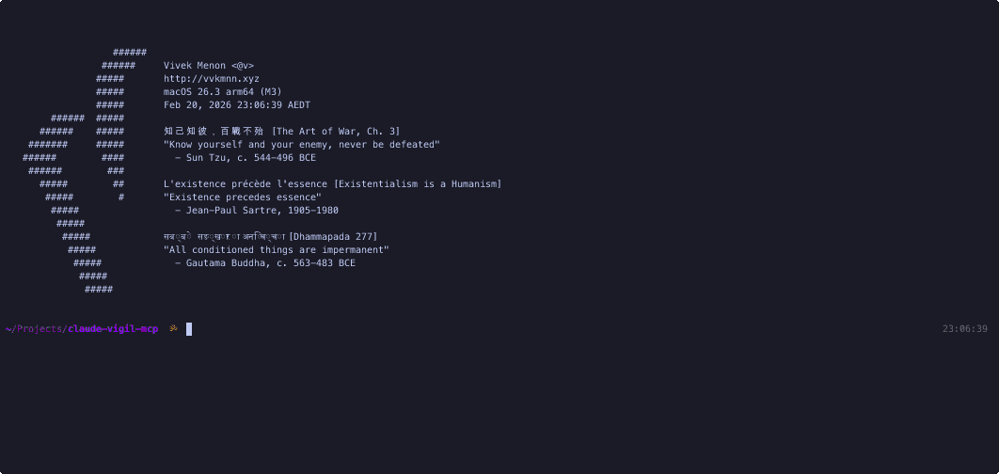

[](https://mseep.ai/app/vvkmnn-claude-vigil-mcp)


# claude-vigil-mcp

An [Model Context Protocol (MCP)](https://modelcontextprotocol.io/) server for **checkpoint, snapshot, and file recovery** in [Claude Code](https://docs.anthropic.com/en/docs/claude-code). Perfect snapshots, selective restore, bash safety net, and honest disk management.

<br clear="right">



[](https://www.npmjs.com/package/claude-vigil-mcp) [](https://opensource.org/licenses/MIT) [](https://www.typescriptlang.org/) [](https://nodejs.org/) [](#) [](https://github.com/Vvkmnn/claude-vigil-mcp)

---

Every AI coding tool tracks file edits made through its own editor, but none of them track file changes made externally: bash commands (`rm`, `mv`, `sed -i`), Python scripts, build tools, or any process that modifies files outside the editor's API. When those changes go wrong, there's nothing to rewind to. Claude Code's built-in `/rewind` has additional gaps -- external changes are invisible ([#6413](https://github.com/anthropics/claude-code/issues/6413), [#10077](https://github.com/anthropics/claude-code/issues/10077)), rewind is all-or-nothing with no selective file restore, timestamps only with no named checkpoints, and reliability bugs ([#21608](https://github.com/anthropics/claude-code/issues/21608), [#18516](https://github.com/anthropics/claude-code/issues/18516)).

## install

**Requirements:**

[![Claude Code](https://img.shields.io/badge/Claude_Code-555?logo=data:image/svg%2bxml;base64,PHN2ZyB4bWxucz0iaHR0cDovL3d3dy53My5vcmcvMjAwMC9zdmciIHZpZXdCb3g9IjAgMCAxOCAxMCIgc2hhcGUtcmVuZGVyaW5nPSJjcmlzcEVkZ2VzIj4KICA8IS0tIENsYXdkOiBDbGF1ZGUgQ29kZSBtYXNjb3QgLS0+CiAgPCEtLSBEZWNvZGVkIGZyb206IOKWkOKWm+KWiOKWiOKWiOKWnOKWjCAvIOKWneKWnOKWiOKWiOKWiOKWiOKWiOKWm+KWmCAvIOKWmOKWmCDilp3ilp0gLS0+CiAgPCEtLSBTdWItcGl4ZWxzIGFyZSAxIHdpZGUgeCAyIHRhbGwgdG8gbWF0Y2ggdGVybWluYWwgY2hhciBjZWxsIGFzcGVjdCByYXRpbyAtLT4KICA8cmVjdCBmaWxsPSIjZDk3NzU3IiB4PSIzIiAgeT0iMCIgd2lkdGg9IjEyIiBoZWlnaHQ9IjIiLz4KICA8cmVjdCBmaWxsPSIjZDk3NzU3IiB4PSIzIiAgeT0iMiIgd2lkdGg9IjIiICBoZWlnaHQ9IjIiLz4KICA8cmVjdCBmaWxsPSIjZDk3NzU3IiB4PSI2IiAgeT0iMiIgd2lkdGg9IjYiICBoZWlnaHQ9IjIiLz4KICA8cmVjdCBmaWxsPSIjZDk3NzU3IiB4PSIxMyIgeT0iMiIgd2lkdGg9IjIiICBoZWlnaHQ9IjIiLz4KICA8cmVjdCBmaWxsPSIjZDk3NzU3IiB4PSIxIiAgeT0iNCIgd2lkdGg9IjE2IiBoZWlnaHQ9IjIiLz4KICA8cmVjdCBmaWxsPSIjZDk3NzU3IiB4PSIzIiAgeT0iNiIgd2lkdGg9IjEyIiBoZWlnaHQ9IjIiLz4KICA8cmVjdCBmaWxsPSIjZDk3NzU3IiB4PSI0IiAgeT0iOCIgd2lkdGg9IjEiICBoZWlnaHQ9IjIiLz4KICA8cmVjdCBmaWxsPSIjZDk3NzU3IiB4PSI2IiAgeT0iOCIgd2lkdGg9IjEiICBoZWlnaHQ9IjIiLz4KICA8cmVjdCBmaWxsPSIjZDk3NzU3IiB4PSIxMSIgeT0iOCIgd2lkdGg9IjEiICBoZWlnaHQ9IjIiLz4KICA8cmVjdCBmaWxsPSIjZDk3NzU3IiB4PSIxMyIgeT0iOCIgd2lkdGg9IjEiICBoZWlnaHQ9IjIiLz4KPC9zdmc+Cg==)](https://claude.ai/code)

**From shell:**

```bash
claude mcp add claude-vigil-mcp -- npx claude-vigil-mcp
```

**From inside Claude** (restart required):

```
Add this to our global mcp config: npx claude-vigil-mcp

Install this mcp: https://github.com/Vvkmnn/claude-vigil-mcp
```

**From any manually configurable `mcp.json`**: (Cursor, Windsurf, etc.)

```json
{
  "mcpServers": {
    "claude-vigil-mcp": {
      "command": "npx",
      "args": ["claude-vigil-mcp"],
      "env": {}
    }
  }
}
```

There is **no `npm install` required** -- no external databases, no indexing, only Node.js built-ins for crypto, compression, and filesystem.

However, if `npx` resolves the wrong package, you can force resolution with:

```bash
npm install -g claude-vigil-mcp
```

## [skill](.claude/skills/claude-vigil)

Optionally, install the skill to teach Claude when to proactively checkpoint before risky work:

```bash
npx skills add Vvkmnn/claude-vigil-mcp --skill claude-vigil --global
# Optional: add --yes to skip interactive prompt and install to all agents
```

This makes Claude automatically save checkpoints before destructive bash commands, risky refactors, or context compaction. The MCP works without the skill, but the skill improves discoverability.

## [plugin](https://github.com/Vvkmnn/claude-emporium)

For automatic checkpointing with hooks and commands, install from the [claude-emporium](https://github.com/Vvkmnn/claude-emporium) marketplace:

```bash
/plugin marketplace add Vvkmnn/claude-emporium
/plugin install claude-vigil@claude-emporium
```

The **claude-vigil** plugin provides:

**Hooks** (background, zero-latency):

- `PreToolUse (Bash)` - auto-quicksave before destructive commands (`rm`, `mv`, `sed -i`, `git checkout`, `git reset`)
- `PreCompact` - auto-checkpoint before context compaction, both manual (`/compact`) and automatic
- `Stop` - auto-checkpoint after Claude finishes a response that included file edits
- `PostToolUse (Write|Edit)` - checkpoint after file modifications
- `SessionEnd` - last-chance checkpoint when the session terminates

**Command:** `/checkpoint <save|list|diff|restore|delete>`

Requires the MCP server installed first. See the emporium for other Claude Code plugins and MCPs.

## features

5 tools. Perfect snapshots. Content diffs. Safe restores with artifact preservation.

#### vigil_save

Create a named checkpoint of the entire project. Optional `description` for annotation. If slots are full, Claude asks the user whether to delete an existing checkpoint or increase capacity.

```
🏺 ┏━ saved "before-refactor" ━━ 47 files · 4.2 MB ━━ vigil: 2/3 | quicksave: 8m ago | 4.2 MB
   ┗ skipped: node_modules, dist, .next
```

First save auto-detects derived directories from `.gitignore` and creates `.vigilignore`:

```
🏺 ┏━ saved "v1.0" ━━ 47 files · 4.1 MB ━━ vigil: 1/3 | quicksave: none | 4.1 MB
   ┃ skipped: node_modules, dist, .next
   ┃ first save -- confirm these exclusions look correct
   ┗ edit .claude/vigil/.vigilignore to adjust
```

When slots are full:

```
🏺 ┏━ 3/3 full -- ask the user before proceeding ━━ vigil: 3/3 | quicksave: 2m ago | 8.7 MB
   ┃ v1.0 (2h ago) · before-refactor (45m ago) · experiment (5m ago)
   ┗ ASK the user: delete one with vigil_delete, or increase capacity with max_checkpoints?
```

#### vigil_list

Browse checkpoints with descriptions. With `name`: drill into that checkpoint's files. With `glob`: filter files by pattern.

```
🏺 ┏━ 2 checkpoints ━━ vigil: 2/3 | quicksave: 3m ago | 8.7 MB
   ┃ v1.0                2h ago    47 files
   ┃   Initial stable release
   ┃ before-refactor     45m ago   47 files
   ┃   Snapshot before risky auth changes
   ┗ ~quicksave          3m ago
```

Drill into a checkpoint with glob filtering:

```
vigil_list name="v1.0" glob="src/auth/**"
```

```
🏺 ┏━ v1.0 ━━ 3 of 47 files matching src/auth/** ━━ vigil: 2/3 | quicksave: 3m ago | 8.7 MB
   ┃ src/auth/index.ts
   ┃ src/auth/middleware.ts
   ┗ src/auth/types.ts
```

#### vigil_diff

Search and investigate previous versions of your codebase. Compare a checkpoint against the current working directory with full unified diffs, compare two checkpoints against each other, retrieve any file's content from any checkpoint, or search for a string across all checkpoints.

**Summary of changes:**

```
vigil_diff name="before-refactor" summary=true
```

```
🏺 ┏━ 3 changes vs before-refactor ━━ vigil: 2/3 | quicksave: 3m ago | 8.7 MB
   ┃ modified  src/auth.ts (+8 -2)
   ┃ modified  src/middleware/validate.ts (+3 -1)
   ┗ added     src/services/oauth.ts
```

**Full unified diffs:**

```
vigil_diff name="before-refactor"
```

```
🏺 ┏━ 3 changes vs before-refactor ━━ vigil: 2/3 | quicksave: 3m ago | 8.7 MB
   ┃ modified  src/auth.ts (+8 -2)
   ┃ modified  src/middleware/validate.ts (+3 -1)
   ┗ added     src/services/oauth.ts

━━ src/auth.ts ━━
--- a/src/auth.ts
+++ b/src/auth.ts
@@ -12,6 +12,8 @@
 import { validateToken } from './utils';
-function authenticate(req: Request) {
+function authenticate(req: Request, options?: AuthOptions) {
+  if (options?.skipValidation) return true;
   const token = req.headers.authorization;
```

**Retrieve a single file from a checkpoint:**

```
vigil_diff name="v1.0" file="src/auth.ts"
```

```
🏺 ━━ src/auth.ts from v1.0 ━━
import { validateToken } from './utils';
function authenticate(req: Request) {
  const token = req.headers.authorization;
  ...

━━ diff vs current ━━
--- a/src/auth.ts
+++ b/src/auth.ts
@@ -12,6 +12,8 @@
-function authenticate(req: Request) {
+function authenticate(req: Request, options?: AuthOptions) {
```

**Compare two checkpoints:**

```
vigil_diff name="v1.0" against="before-refactor"
```

Shows unified diffs between the two checkpoint states -- no working directory involved.

**Search across all checkpoints:**

```
vigil_diff name="*" file="src/auth.ts" search="validateToken"
```

```
🏺 ┏━ "validateToken" in src/auth.ts ━━ 2 checkpoints ━━ vigil: 2/3 | quicksave: 3m ago | 8.7 MB
   ┃ v1.0 (2h ago)
   ┃   import { validateToken } from './utils';
   ┃ before-refactor (45m ago)
   ┗   import { validateToken } from './utils';
```

#### vigil_restore

Restore the project to a checkpoint state. Quicksaves current state first (undo with `vigil_restore name="~quicksave"`). Displaced files -- both modified and newly created since the checkpoint -- are preserved in `.claude/vigil/artifacts/` so nothing is ever lost. For individual file restores, use `vigil_diff` to retrieve file content, then apply with Edit.

```
vigil_restore name="v1.0"
```

```
🏺 ┏━ restored from "v1.0" ━━ 47 files ━━ vigil: 2/3 | quicksave: just now | 8.7 MB
   ┃ preserved 3 displaced files in .claude/vigil/artifacts/restored_v1.0_20260219_143022/
   ┃   modified: src/auth.ts (current version saved)
   ┃   modified: src/middleware/validate.ts (current version saved)
   ┃   new: src/services/oauth.ts (moved, not in checkpoint)
   ┃ review .claude/vigil/artifacts/restored_v1.0_20260219_143022/ -- delete when no longer needed
   ┃ previous state also quicksaved (use ~quicksave to undo)
   ┃ not restored (derived): node_modules, dist
   ┗ rebuild these before running the project
```

#### vigil_delete

Delete a checkpoint and reclaim disk space. GC removes unreferenced objects. Use `all=true` to delete everything.

```
vigil_delete name="v1.0"
```

```
🏺 ━━ deleted v1.0 ━━ reclaimed 241 MB (3,412 objects) ━━ vigil: 1/3 | quicksave: 3m ago | 4.5 MB
```

## methodology

How [claude-vigil-mcp](https://github.com/Vvkmnn/claude-vigil-mcp) [stores](https://github.com/Vvkmnn/claude-vigil-mcp/tree/main/src) checkpoints:

```
                    🏺 claude-vigil-mcp
                    ━━━━━━━━━━━━━━━━━━━

              Claude calls tool
                vigil_save
                    │
                    ▼
              ┌─────────────────┐
              │  spawn worker   │  <5ms, returns immediately
              │  (detached)     │
              └────────┬────────┘
                       │
            ┌──────────┴──────────┐
            │   background worker │
            │                     │
            │  ┌───────────────┐  │
            │  │ walk project  │  │  source files only (skips derived dirs)
            │  └───────┬───────┘  │
            │          │          │
            │  ┌───────▼───────┐  │
            │  │ hash (SHA-256)│  │  same content = same hash
            │  └───────┬───────┘  │
            │          │          │
            │  ┌───────▼───────┐  │
            │  │ gzip + store  │  │  dedup: skip if exists
            │  └───────┬───────┘  │
            │          │          │
            │  ┌───────▼───────┐  │
            │  │update manifest│  │  {path → hash} per checkpoint
            │  └───────────────┘  │
            └─────────────────────┘

     ┌─────────────────────────────────────────┐
     │  .claude/vigil/                         │
     │  ├── manifest.json    checkpoints + meta│
     │  ├── objects/                           │
     │  │   ├── ab/cdef01...gz   gzipped file  │
     │  │   ├── f3/981a02...gz   gzipped file  │
     │  │   └── ...              (deduped)     │
     │  └── artifacts/                         │
     │      └── restored_v1.0_20260219_.../    │
     │          ├── src/auth.ts   (modified)   │
     │          └── src/new.ts    (new file)   │
     └─────────────────────────────────────────┘

     3 named slots + 1 rotating quicksave
     Every response: "vigil: 2/3 | quicksave: 3m ago | 287 MB"


     RESTORE (only sync operation):

     vigil_restore("v1.0")
            │
            ├── quicksave current state (overwrite previous)
            │
            ├── preserve displaced files in artifacts/
            │   ├── modified files → copied to artifacts
            │   └── new files → moved to artifacts
            │
            ├── read manifest → get {path → hash}
            │
            ├── for each file: gunzip object → write to project
            │
            └── done: bit-identical working directory
```

**Storage:** Content-addressable storage (SHA-256 + gzip). Same file across checkpoints = stored once. Binary files included -- a restored checkpoint is bit-identical to the original.

**Performance:** Background worker via `spawn(detached)`. MCP tool returns in <5ms. Worker runs independently. Only `vigil_restore` is synchronous (must write files before Claude proceeds).

**Disk honesty:** Every tool response shows `vigil: 2/3 | quicksave: 3m ago | 273 MB`. No hidden costs. 3 checkpoint slots by default. `.vigilignore` for excluding paths you don't need.

**Artifact preservation:** On restore, files that would be overwritten or lost (modified since checkpoint, or newly created) are preserved in `.claude/vigil/artifacts/`. Nothing is ever deleted -- you can always recover displaced work.

```
                  v1.0        v1.1        v1.2      objects/
                  ━━━━        ━━━━        ━━━━      ━━━━━━━━━━━━━━━━

  src/index.ts    ab3f ══════ ab3f ══════ ab3f  →   ab/3f01a2...gz
  src/auth.ts     f981        e904 ══════ e904  →   f9/81b3c4...gz
                                                    e9/04f7a8...gz
  src/server.ts   2bc4 ══════ 2bc4 ══════ 2bc4  →   2b/c4d5e6...gz
  src/utils.ts    7de1 ══════ 7de1 ══════ 7de1  →   7d/e1f2a0...gz
  src/config.ts   4aa2 ══════ 4aa2        d71c  →   4a/a2b1c3...gz
                                                    d7/1c45e8...gz
                  ────        ────        ────
  new objects:    5           1           1     =   7 (not 15)

  ══════ same SHA-256 across checkpoints -- stored once, referenced many
```

```
  save v1.0       ██████████████████████████████████████████████████  100 new
  save v1.1       ░░░░░░░░░░░░░░░░░░░░░░░░░░░░░░░░░░░░░░░░░░░░░░████    8 new
  save v1.2       ░░░░░░░░░░░░░░░░░░░░░░░░░░░░░░░░░░░░░░░░░░░░░░░░██    3 new
                  ──────────────────────────────────────────────────
                  111 objects store 300 file-versions     2.7× dedup

  delete v1.0     gc sweep → 62 orphans freed, 49 shared retained
                  ░░░░░░░░░░░░░░░░░░░░░░░░░               4.1× dedup

  ████ new object stored    ░░░░ deduped (hash exists, write skipped)
```

**Core techniques:**

- [content-addressable storage](https://github.com/Vvkmnn/claude-vigil-mcp/blob/main/src/store.ts#L41) (`storeObject`): SHA-256 hash → `existsSync` check → skip or gzip + write. Same content = same address = automatic dedup.
- [mark-and-sweep GC](https://github.com/Vvkmnn/claude-vigil-mcp/blob/main/src/store.ts#L71) (`gcObjects`): Union referenced hashes across all checkpoints, delete orphans, reclaim space.
- [LCS unified diffs](https://github.com/Vvkmnn/claude-vigil-mcp/blob/main/src/snapshot.ts#L333) (`generateUnifiedDiff`): O(n×m) longest common subsequence with 3-line context hunks.
- [cross-checkpoint search](https://github.com/Vvkmnn/claude-vigil-mcp/blob/main/src/snapshot.ts#L676) (`diffCheckpoint` search mode): Iterate checkpoints → resolve file hash → gunzip → line scan with ±2 context.
- [background snapshots](https://github.com/Vvkmnn/claude-vigil-mcp/blob/main/src/worker.ts#L28) (`worker.ts`): `spawn(detached)` with `.in-progress` lockfile, <5ms return to Claude.


**Disk usage:** Vigil auto-skips derived directories (`node_modules/`, `dist/`, `target/`, `venv/`, etc.) detected from `.gitignore` and common patterns. Only source files are checkpointed.

| Project type   | Raw size | Source only | First snapshot | Incremental |
| -------------- | -------- | ----------- | -------------- | ----------- |
| Next.js app    | 750 MB   | ~2 MB       | ~1 MB          | ~50 KB      |
| Rust project   | 2.5 GB   | ~5 MB       | ~3 MB          | ~100 KB     |
| Python project | 350 MB   | ~3 MB       | ~2 MB          | ~50 KB      |

After restore, vigil reports which derived dirs exist but weren't restored -- Claude rebuilds them (`npm install`, `cargo build`, etc.). Edit `.claude/vigil/.vigilignore` to adjust what gets skipped.

**Architecture:**

```
claude-vigil-mcp/
├── package.json
├── tsconfig.json
├── src/
│   ├── index.ts       # MCP server, 5 tools
│   ├── types.ts       # TypeScript interfaces and discriminated unions
│   ├── store.ts       # CAS: hash, store, read, gc, disk usage
│   ├── snapshot.ts    # create, restore, diff, list, delete
│   └── worker.ts      # background snapshot process
├── .claude/
│   └── skills/
│       └── claude-vigil/
│           └── SKILL.md   # optional skill for proactive checkpointing
└── test/
    └── index.test.ts  # 73 tests
```

**Design principles:**

- **No git dependency** -- pure Node.js built-ins (crypto, zlib, fs)
- **Perfect snapshots** -- every file captured, no size/binary filtering
- **CAS + gzip** -- 3.5x leaner than hard links, automatic dedup
- **Background execution** -- Claude never blocks on snapshot creation
- **3-slot limit** -- conservative default prevents runaway storage
- **Stateless server** -- reads manifest from disk each call, no in-memory state to lose
- **Artifact preservation** -- displaced files saved on restore, nothing ever lost
- **Cross-platform** -- macOS, Linux, Windows. No shell dependencies

**Design influences:**

- [Content-addressable storage](https://en.wikipedia.org/wiki/Content-addressable_storage) -- same content = same address, automatic deduplication
- [Mark-and-sweep garbage collection](https://en.wikipedia.org/wiki/Tracing_garbage_collection#Na%C3%AFve_mark-and-sweep) -- reference counting alternative for CAS cleanup
- [Longest common subsequence](https://en.wikipedia.org/wiki/Longest_common_subsequence) -- foundation of unified diff generation
- [Git object model](https://git-scm.com/book/en/v2/Git-Internals-Git-Objects) -- inspiration for hash-sharded storage (vigil uses SHA-256 + gzip instead of git's SHA-1 + zlib)

## alternatives

Every existing checkpoint tool -- built-in or third-party -- only tracks file edits made through the editor's own API. When Claude runs `sed -i`, a Python script overwrites a config, or a build tool corrupts output, those changes are invisible and unrecoverable.

| Feature                       | **vigil**                   | /rewind                                                               | Rewind-MCP | claude-code-rewind | Checkpoints app | Cursor       |
| ----------------------------- | --------------------------- | --------------------------------------------------------------------- | ---------- | ------------------ | --------------- | ------------ |
| **Tracks external changes**   | **Yes (bash, scripts, builds)** | No                                                                | No         | No                 | No              | No           |
| **Named checkpoints**         | **Yes**                     | No (timestamps)                                                       | Yes        | Yes                | Yes             | No           |
| **Content diffs**             | **Yes (unified diffs)**     | No                                                                    | No         | Yes (visual)       | No              | No           |
| **Search across checkpoints** | **Yes**                     | No                                                                    | No         | No                 | No              | No           |
| **Artifact preservation**     | **Yes (nothing lost)**      | N/A                                                                   | No         | No                 | No              | No           |
| **Dedup storage**             | **CAS + gzip**              | None                                                                  | Unknown    | SQLite + diffs     | Full copies     | Zip per edit |
| **Background saves**          | **Yes (<5ms return)**       | Blocking                                                              | Blocking   | Blocking           | Background      | Blocking     |
| **Headless/programmatic**     | **Yes (MCP)**               | No ([#16976](https://github.com/anthropics/claude-code/issues/16976)) | Yes (MCP)  | CLI                | No              | No           |
| **Cross-platform**            | **Node.js**                 | Built-in                                                              | Node.js    | Python             | macOS only      | Built-in     |
| **Dependencies**              | **0 (Node built-ins)**      | N/A                                                                   | Node.js    | Python + SQLite    | Desktop app     | N/A          |
| **Disk visibility**           | **Every response**          | Hidden                                                                | Manual     | Manual             | Manual          | Hidden       |

**[Claude Code /rewind](https://code.claude.com/docs/en/checkpointing)** -- Built-in checkpoint system. Only tracks file edits made through Claude's own tools -- `sed -i`, build scripts, and external processes are invisible. No named checkpoints, no content diffs, no search. Blocking saves that pause the session. Not yet available via MCP ([#16976](https://github.com/anthropics/claude-code/issues/16976)).

**[Rewind-MCP](https://github.com/khalilbalaree/Rewind-MCP)** -- Third-party MCP server with stack-based undo. Provides MCP access but doesn't track external changes (bash, scripts, builds). No content diffs, no search across checkpoints, no dedup storage. Blocking saves.

**[claude-code-rewind](https://github.com/holasoymalva/claude-code-rewind)** -- Python-based snapshot tool with SQLite metadata and visual diffs. Requires Python + SQLite. Doesn't track external changes. No cross-checkpoint search, no artifact preservation, no background saves. CLI-only (no MCP integration).

**[Checkpoints app](https://claude-checkpoints.com/)** -- macOS desktop app that monitors projects for file changes. Background saves but macOS-only, no content diffs, no search, no MCP integration. Stores full copies of each checkpoint (no dedup), so disk usage grows linearly.

**[Cursor checkpoints](https://stevekinney.com/courses/ai-development/cursor-checkpoints)** -- Built-in to Cursor. Zips project state before each AI edit. No named checkpoints, no content diffs, no search, no external change tracking. Hidden from disk, blocking saves, not programmable.

Three implementation approaches were evaluated before settling on content-addressable storage:

- **Shadow git repo** (`git --git-dir=.claude/vigil/.git --work-tree=.`) -- wraps git for dedup, diff, and restore. 6 failure modes: self-tracking recursion, unbounded binary bloat, concurrent `index.lock` conflicts, overlay on restore (doesn't delete files added after checkpoint), `git clean` destroying project files, and `GIT_DIR`/`GIT_WORK_TREE` env var interference from parent processes.
- **Hard-link Time Machine pattern** -- directory trees with unchanged files hard-linked (zero per-file cost). Battle-tested by macOS Time Machine, but 20 checkpoints of 1000 files = 20,000 directory entries. CAS + gzip is 3.5x leaner and deduplicates content across checkpoints for free.
- **rsync --link-dest** -- same hard-link idea in ~30 lines. No built-in diff capability, losing the unified diffs and cross-checkpoint search that make `vigil_diff` useful.

## development

```bash
git clone https://github.com/Vvkmnn/claude-vigil-mcp && cd claude-vigil-mcp
npm install && npm run build
npm test
```

**Scripts:**

| Command | Description |
| --- | --- |
| `npm run build` | TypeScript compilation (`tsc && chmod +x dist/index.js`) |
| `npm run dev` | Watch mode (`tsc --watch`) |
| `npm start` | Run MCP server (`node dist/index.js`) |
| `npm run clean` | Remove build artifacts (`rm -rf dist`) |
| `npm run lint` | ESLint code quality checks |
| `npm run lint:fix` | Auto-fix linting issues |
| `npm run format` | Prettier formatting |
| `npm run format:check` | Check formatting without changes |
| `npm run typecheck` | TypeScript validation without emit |
| `npm test` | Type-check + lint |
| `npm run prepublishOnly` | Pre-publish validation (build + lint + format check) |

Pre-commit hooks via [husky](https://typicode.github.io/husky/) run `lint-staged` (prettier + eslint) on staged `.ts` files.

Contributing:

- Fork the repository and create feature branches
- Follow TypeScript strict mode and [MCP protocol](https://modelcontextprotocol.io/specification) standards

Learn from examples:

- [Official MCP servers](https://github.com/modelcontextprotocol/servers) for reference implementations
- [TypeScript SDK](https://github.com/modelcontextprotocol/typescript-sdk) for best practices
- [Creating Node.js modules](https://docs.npmjs.com/creating-node-js-modules) for npm package development

## license

[MIT](LICENSE)

<hr>

<p align="center"><a href="https://en.wikipedia.org/wiki/Claudius#/media/File:Lebayle_-_Claudius.jpg"></a></p>

<p align="center">

_**[Claudius Proclaimed Emperor](https://en.wikipedia.org/wiki/Claudius#/media/File:Lebayle_-_Claudius.jpg)** by **[Charles Lebayle](https://en.wikipedia.org/wiki/Charles_Lebayle)** (1886). Claudius expanded the Vigiles Urbani from firefighters into Rome's night watch -- guardians who patrolled the city, preserved order, and ensured nothing was lost to the dark._

</p>
